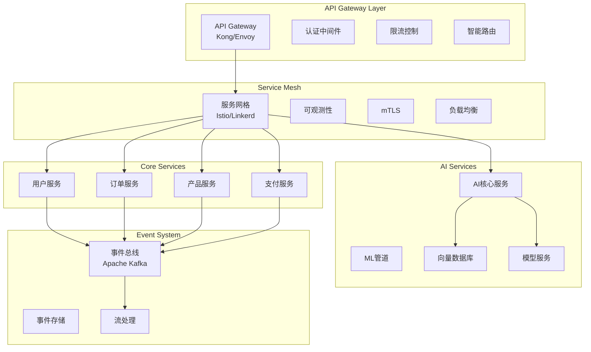

# 2025年企业级后端架构设计

## 架构概述

本文档描述了一个现代化的企业级后端架构，集成了微服务3.0、AI原生系统、零信任安全等2025年的关键技术趋势。

## 1. 微服务3.0架构模式

### 1.1 核心设计原则



### 1.2 服务拆分策略

**按业务能力拆分**
- 用户域：用户管理、身份认证、权限控制
- 产品域：产品管理、库存、分类
- 订单域：订单处理、购物车、支付
- AI域：智能推荐、自然语言处理、预测分析

**按技术特性拆分**
- 事件溯源服务
- 读写分离服务（CQRS）
- 高性能计算服务

### 1.3 服务间通信模式

```typescript
// 同步通信 - RESTful API with circuit breaker
interface ServiceCommunication {
  // HTTP/3 + gRPC
  @CircuitBreaker(failureRateThreshold = 50, waitDurationInOpenState = 30s)
  @Retry(maxAttempts = 3)
  async getUserProfile(userId: string): Promise<UserProfile>

  // 异步通信
  @EventDriven
  async publishUserCreatedEvent(event: UserCreatedEvent): Promise<void>
}

// 事件驱动通信
interface EventSourcing {
  @EventVersion('2.0')
  @SchemaRegistry
  interface DomainEvent {
    eventId: string
    aggregateId: string
    eventType: string
    eventData: any
    eventTimestamp: ISODateTime
    causationId?: string
    correlationId?: string
  }
}
```

## 2. AI原生系统设计

### 2.1 AI服务架构

```typescript
// AI服务抽象层
interface AIServiceArchitecture {
  // 模型管理系统
  modelRegistry: {
    registerModel: (model: AIModel) => Promise<ModelMetadata>
    deployModel: (modelId: string, version: string) => Promise<DeploymentStatus>
    monitorPerformance: (modelId: string) => Promise<ModelMetrics>
  }

  // 推理服务
  inferenceEngine: {
    predict: <Input, Output>(request: PredictionRequest<Input>) => Promise<PredictionResult<Output>>
    batchPredict: <Input, Output>(requests: PredictionRequest<Input>[]) => Promise<PredictionResult<Output>[]>
    streamPredict: <Input, Output>(requestStream: AsyncIterable<PredictionRequest<Input>>) => AsyncIterable<PredictionResult<Output>>
  }

  // 数据管道
  dataPipeline: {
    ingestData: (dataSource: DataSource) => Promise<void>
    transformData: (data: RawData, transform: DataTransform) => Promise<ProcessedData>
    vectorizeData: (data: ProcessedData, embeddingModel: string) => Promise<VectorData>
  }
}
```

### 2.2 Vector DB集成

```typescript
// 向量数据库集成
class VectorDatabaseIntegration {
  private vectorDB: ChromaDB | Weaviate | Pinecone

  constructor(config: VectorDBConfig) {
    this.vectorDB = new VectorDBClient(config)
  }

  // 语义搜索
  async semanticSearch(query: string, limit: number = 10): Promise<SearchResult[]> {
    const queryVector = await this.generateEmbedding(query)
    return this.vectorDB.query({
      vector: queryVector,
      topK: limit,
      includeMetadata: true
    })
  }

  // 混合搜索（向量+关键词）
  async hybridSearch(
    query: string,
    filters: SearchFilter[],
    limit: number = 10
  ): Promise<SearchResult[]> {
    const queryVector = await this.generateEmbedding(query)
    return this.vectorDB.hybridSearch({
      vector: queryVector,
      query: query,
      filter: filters,
      topK: limit,
      alpha: 0.7 // 向量和关键词权重
    })
  }

  private async generateEmbedding(text: string): Promise<number[]> {
    // 使用OpenAI Embeddings API或本地模型
    const response = await this.aiClient.embeddings.create({
      model: 'text-embedding-3-small',
      input: text
    })
    return response.data[0].embedding
  }
}
```

### 2.3 MLOps集成

```typescript
// MLOps管道集成
class MLOpsPipeline {
  // 特征工程
  async featureEngineering(rawData: any[]): Promise<FeatureVector[]> {
    return rawData.map(item => ({
      userId: item.userId,
      features: {
        demographic: this.extractDemographics(item),
        behavioral: this.extractBehavioralFeatures(item),
        contextual: this.extractContextualFeatures(item)
      },
      timestamp: new Date().toISOString()
    }))
  }

  // 模型训练管道
  async trainModel(config: TrainingConfig): Promise<TrainingResult> {
    const pipeline = this.kubeflowClient.createPipeline({
      name: 'customer-behavior-prediction',
      spec: {
        parameters: config,
        components: [
          { name: 'data-preprocessing', image: 'preprocessing:v2.0' },
          { name: 'feature-engineering', image: 'feature-engineering:v2.0' },
          { name: 'model-training', image: 'training:v2.0' },
          { name: 'model-evaluation', image: 'evaluation:v2.0' }
        ]
      }
    })

    return await pipeline.execute()
  }
}
```

## 3. 零信任安全架构

### 3.1 零信任原则实现

```typescript
// 零信任安全策略
interface ZeroTrustSecurity {
  // 身份认证
  authentication: {
    // 多因素认证
    mfaConfig: {
      requiredFactors: 2
      allowedMethods: ['TOTP', 'FIDO2', 'SMS']
      adaptiveAuth: true // 基于风险的自适应认证
    }

    // 无密码认证
    passwordlessEnabled: true
    passkeySupported: true
    biometricSupported: true
  }

  // 授权策略
  authorization: {
    // ABAC (Attribute-Based Access Control)
    policyEngine: OPA | OpenPolicyAgent
    policyDecisionPoint: 'policy-service'
    policyEnforcementPoints: ['api-gateway', 'service-mesh']

    // 动态权限评估
    contextualAccess: {
      locationBased: true
      deviceBased: true
      timeBased: true
      behaviorBased: true
    }
  }

  // 网络安全
  networkSecurity: {
    // mTLS everywhere
    mtlsEnabled: true
    certificateRotation: '24h'

    // 服务间加密
    serviceToServiceEncryption: 'AES-256-GCM'

    // 零信任网络分段
    networkSegments: [
      { name: 'public', services: ['api-gateway'] },
      { name: 'application', services: ['user-service', 'order-service'] },
      { name: 'data', services: ['database', 'cache'] },
      { name: 'ai', services: ['ai-service', 'model-serving'] }
    ]
  }
}
```

### 3.2 安全中间件实现

```typescript
// 零信任安全中间件
class ZeroTrustMiddleware {
  private authClient: Auth0Client | KeycloakClient
  private policyEngine: OPAEngine
  private riskEngine: RiskAssessmentEngine

  // 请求拦截和验证
  async validateRequest(req: Request): Promise<SecurityContext> {
    const securityContext: SecurityContext = {
      identity: await this.authenticateRequest(req),
      authorization: await this.authorizeRequest(req),
      risk: await this.assessRisk(req),
      compliance: await this.checkCompliance(req)
    }

    // 动态安全策略应用
    if (securityContext.risk.score > 0.7) {
      return this.applyHighSecurityMeasures(securityContext)
    }

    return securityContext
  }

  private async authenticateRequest(req: Request): Promise<Identity> {
    // JWT + FIDO2 验证
    const token = this.extractToken(req)
    const jwtPayload = await this.verifyJWT(token)
    const fido2Assertion = await this.verifyFIDO2(req)

    return {
      userId: jwtPayload.sub,
      authMethods: [jwtPayload.auth_method, fido2Assertion?.type],
      authTime: jwtPayload.auth_time,
      sessionValidity: this.calculateSessionValidity(jwtPayload, fido2Assertion)
    }
  }

  private async authorizeRequest(req: Request): Promise<AuthorizationDecision> {
    const policyRequest = {
      input: {
        user: req.user,
        action: req.method,
        resource: req.path,
        context: {
          ip: req.ip,
          userAgent: req.headers['user-agent'],
          timestamp: new Date().toISOString()
        }
      }
    }

    return this.policyEngine.evaluate(policyRequest)
  }

  private async assessRisk(req: Request): Promise<RiskAssessment> {
    const riskFactors = await Promise.all([
      this.riskEngine.analyzeBehaviorPattern(req.user.id),
      this.riskEngine.anomalyDetection(req.ip, req.userAgent),
      this.riskEngine.geoLocationAnalysis(req.ip),
      this.riskEngine.timeBasedAnalysis(req.user.id)
    ])

    const combinedRisk = this.calculateCompositeRisk(riskFactors)

    return {
      score: combinedRisk,
      factors: riskFactors,
      recommendations: this.generateSecurityRecommendations(combinedRisk)
    }
  }
}
```

## 4. Node.js 22+ 和 PostgreSQL 16+ 技术栈

### 4.1 Node.js 22+ 特性应用

```typescript
// 使用Node.js 22+的最新特性
class ModernNodeJSApplication {
  // 使用Fetch API (Node.js 18+)
  async fetchData<T>(url: string): Promise<T> {
    const response = await fetch(url, {
      method: 'GET',
      headers: {
        'Content-Type': 'application/json'
      }
    })
    return response.json() as Promise<T>
  }

  // 使用Array.findLast() (Node.js 22+)
  findLastOrder(orders: Order[], condition: (order: Order) => boolean): Order | undefined {
    return orders.findLast(condition)
  }

  // 使用ShadowRealm (实验性功能)
  async runInShadowRealm(code: string, context: any): Promise<any> {
    const realm = new ShadowRealm()
    return realm.evaluate(`
      (${code.toString()})(${JSON.stringify(context)})
    `)
  }

  // 使用WebAssembly (WASI支持)
  async loadWASMModule(wasmPath: string): Promise<any> {
    const wasmModule = await WebAssembly.compileStreaming(
      fetch(wasmPath)
    )
    return await WebAssembly.instantiate(wasmModule)
  }
}
```

### 4.2 PostgreSQL 16+ 集成

```typescript
// PostgreSQL 16+ 高级特性集成
class PostgreSQLIntegration {
  private pool: Pool

  constructor(config: DatabaseConfig) {
    this.pool = new Pool({
      ...config,
      // 使用连接池优化
      max: 20,
      idleTimeoutMillis: 30000,
      connectionTimeoutMillis: 2000,

      // 启用SSL
      ssl: config.ssl ? {
        rejectUnauthorized: false,
        ca: fs.readFileSync(config.ssl.ca).toString(),
        key: fs.readFileSync(config.ssl.key).toString(),
        cert: fs.readFileSync(config.ssl.cert).toString()
      } : false
    })
  }

  // 使用JSONB优化查询
  async queryWithJSONB(filters: JSONBFilter): Promise<any[]> {
    const query = `
      SELECT * FROM products
      WHERE metadata @> $1::jsonb
      AND created_at > $2::timestamp
      ORDER BY metadata->>'priority' DESC
      LIMIT $3
    `

    const result = await this.pool.query(query, [
      JSON.stringify(filters.metadata),
      filters.since,
      filters.limit
    ])

    return result.rows
  }

  // 使用PostgreSQL 16+的MERGE功能
  async upsertWithMerge(data: UpsertData): Promise<void> {
    const query = `
      MERGE INTO user_profiles AS target
      USING (SELECT $1::uuid as user_id, $2::jsonb as data) AS source
      ON target.user_id = source.user_id
      WHEN MATCHED THEN
        UPDATE SET
          profile_data = source.data,
          updated_at = CURRENT_TIMESTAMP
      WHEN NOT MATCHED THEN
        INSERT (user_id, profile_data, created_at, updated_at)
        VALUES (source.user_id, source.data, CURRENT_TIMESTAMP, CURRENT_TIMESTAMP)
    `

    await this.pool.query(query, [data.userId, data.profileData])
  }

  // 使用分区表优化大数据查询
  async createPartitionedTable(): Promise<void> {
    const query = `
      CREATE TABLE IF NOT EXISTS events (
        id UUID PRIMARY KEY DEFAULT gen_random_uuid(),
        event_type VARCHAR(100) NOT NULL,
        event_data JSONB NOT NULL,
        created_at TIMESTAMP WITH TIME ZONE DEFAULT CURRENT_TIMESTAMP,
        user_id UUID
      ) PARTITION BY RANGE (created_at);

      -- 创建月度分区
      CREATE TABLE IF NOT EXISTS events_2025_01
        PARTITION OF events
        FOR VALUES FROM ('2025-01-01') TO ('2025-02-01');
    `

    await this.pool.query(query)
  }

  // 使用并行查询优化
  async parallelQuery(complexFilters: ComplexFilter[]): Promise<any[]> {
    const query = `
      SELECT /*+ PARALLEL 8 */
        u.id, u.email,
        COUNT(o.id) as order_count,
        SUM(o.total_amount) as total_spent
      FROM users u
      LEFT JOIN orders o ON u.id = o.user_id
      WHERE u.created_at BETWEEN $1 AND $2
        AND o.status = ANY($3)
      GROUP BY u.id, u.email
      ORDER BY total_spent DESC NULLS LAST
      LIMIT $4
    `

    const result = await this.pool.query(query, [
      complexFilters.dateRange.start,
      complexFilters.dateRange.end,
      complexFilters.statuses,
      complexFilters.limit
    ])

    return result.rows
  }
}
```

### 4.3 TypeScript配置优化

```json
{
  "compilerOptions": {
    "target": "ES2023",
    "module": "ESNext",
    "moduleResolution": "bundler",
    "lib": ["ES2023"],
    "strict": true,
    "noImplicitAny": true,
    "strictNullChecks": true,
    "strictFunctionTypes": true,
    "noImplicitReturns": true,
    "noFallthroughCasesInSwitch": true,
    "exactOptionalPropertyTypes": true,
    "noUncheckedIndexedAccess": true,
    "declaration": true,
    "declarationMap": true,
    "sourceMap": true,
    "outDir": "./dist",
    "rootDir": "./src",
    "esModuleInterop": true,
    "allowSyntheticDefaultImports": true,
    "forceConsistentCasingInFileNames": true,
    "skipLibCheck": true,
    "experimentalDecorators": true,
    "emitDecoratorMetadata": true
  },
  "include": ["src/**/*"],
  "exclude": ["node_modules", "dist"]
}
```

## 5. 分布式系统和事件驱动架构

### 5.1 分布式事务管理

```typescript
// Saga模式实现分布式事务
class SagaOrchestrator {
  private sagaState: Map<string, SagaInstance> = new Map()

  async executeSaga(sagaDefinition: SagaDefinition, input: any): Promise<any> {
    const sagaId = uuidv4()
    const sagaInstance: SagaInstance = {
      id: sagaId,
      definition: sagaDefinition,
      currentState: 'STARTED',
      executedSteps: [],
      compensating: false,
      input,
      output: null,
      error: null
    }

    this.sagaState.set(sagaId, sagaInstance)

    try {
      return await this.executeSteps(sagaInstance)
    } catch (error) {
      await this.compensate(sagaInstance, error)
      throw error
    }
  }

  private async executeSteps(instance: SagaInstance): Promise<any> {
    let currentData = instance.input

    for (const step of instance.definition.steps) {
      try {
        const stepResult = await this.executeStep(step, currentData)
        instance.executedSteps.push({
          stepName: step.name,
          result: stepResult,
          compensation: step.compensation
        })
        currentData = { ...currentData, ...stepResult }
      } catch (error) {
        instance.error = error
        throw error
      }
    }

    instance.output = currentData
    instance.currentState = 'COMPLETED'
    return currentData
  }

  private async compensate(instance: SagaInstance, originalError: Error): Promise<void> {
    instance.compensating = true
    instance.currentState = 'COMPENSATING'

    // 逆序执行补偿操作
    for (const executedStep of instance.executedSteps.reverse()) {
      try {
        if (executedStep.compensation) {
          await this.executeStep(executedStep.compensation, executedStep.result)
        }
      } catch (compensationError) {
        // 记录补偿失败但不中断补偿流程
        console.error(`Compensation failed for step ${executedStep.stepName}:`, compensationError)
      }
    }

    instance.currentState = 'COMPENSATED'
  }

  private async executeStep(step: SagaStep, data: any): Promise<any> {
    if (step.type === 'HTTP_API') {
      return this.executeHTTPStep(step, data)
    } else if (step.type === 'EVENT_PUBLISH') {
      return this.executeEventStep(step, data)
    } else if (step.type === 'DATABASE_OPERATION') {
      return this.executeDBStep(step, data)
    }
    throw new Error(`Unknown step type: ${step.type}`)
  }
}

// 使用示例
const orderProcessingSaga: SagaDefinition = {
  name: 'order-processing',
  steps: [
    {
      name: 'reserve-inventory',
      type: 'HTTP_API',
      endpoint: '/inventory/reserve',
      data: { productId: '{{productId}}', quantity: '{{quantity}}' },
      compensation: {
        name: 'release-inventory',
        type: 'HTTP_API',
        endpoint: '/inventory/release',
        data: { reservationId: '{{reservationId}}' }
      }
    },
    {
      name: 'process-payment',
      type: 'HTTP_API',
      endpoint: '/payment/process',
      data: { orderId: '{{orderId}}', amount: '{{amount}}' },
      compensation: {
        name: 'refund-payment',
        type: 'HTTP_API',
        endpoint: '/payment/refund',
        data: { paymentId: '{{paymentId}}' }
      }
    },
    {
      name: 'create-order',
      type: 'DATABASE_OPERATION',
      operation: 'INSERT',
      table: 'orders',
      data: { orderId: '{{orderId}}', userId: '{{userId}}', status: 'CONFIRMED' },
      compensation: {
        name: 'cancel-order',
        type: 'DATABASE_OPERATION',
        operation: 'UPDATE',
        table: 'orders',
        data: { status: 'CANCELLED' },
        condition: { orderId: '{{orderId}}' }
      }
    },
    {
      name: 'order-confirmed-event',
      type: 'EVENT_PUBLISH',
      topic: 'order-events',
      event: {
        type: 'ORDER_CONFIRMED',
        data: { orderId: '{{orderId}}', userId: '{{userId}}' }
      }
    }
  ]
}
```

### 5.2 事件驱动架构实现

```typescript
// 事件驱动架构核心组件
class EventDrivenArchitecture {
  private eventBus: KafkaEventBus
  private eventStore: PostgresEventStore
  private projectionManager: ProjectionManager

  constructor(config: EventDrivenConfig) {
    this.eventBus = new KafkaEventBus(config.kafka)
    this.eventStore = new PostgresEventStore(config.database)
    this.projectionManager = new ProjectionManager(config.projections)
  }

  // 发布事件
  async publishEvent(event: DomainEvent): Promise<void> {
    // 验证事件
    this.validateEvent(event)

    // 持久化事件
    await this.eventStore.append(event)

    // 发布到事件总线
    await this.eventBus.publish(event.eventType, event)

    // 更新投影
    await this.projectionManager.updateProjections(event)
  }

  // 事件订阅和处理
  async subscribeToEvent(
    eventType: string,
    handler: EventHandler,
    options: SubscriptionOptions = {}
  ): Promise<void> {
    await this.eventBus.subscribe(eventType, async (event) => {
      try {
        // 幂等性检查
        if (await this.isEventProcessed(event.eventId, handler.name)) {
          return
        }

        // 处理事件
        await handler.handle(event)

        // 标记为已处理
        await this.markEventProcessed(event.eventId, handler.name)

      } catch (error) {
        // 错误处理和重试逻辑
        await this.handleEventProcessingError(event, handler, error)
      }
    })
  }

  // 事件溯源查询
  async getAggregateHistory(
    aggregateId: string,
    fromVersion?: number
  ): Promise<DomainEvent[]> {
    return this.eventStore.getEvents(aggregateId, fromVersion)
  }

  // 快照管理
  async createSnapshot(aggregate: AggregateRoot): Promise<void> {
    if (aggregate.getVersion() % 10 === 0) { // 每10个版本创建快照
      await this.eventStore.saveSnapshot(aggregate)
    }
  }

  // 事件重放
  async replayEvents(aggregateId: string, toVersion?: number): Promise<AggregateRoot> {
    const events = await this.eventStore.getEvents(aggregateId, undefined, toVersion)

    // 检查是否有快照
    const snapshot = await this.eventStore.getLatestSnapshot(aggregateId, toVersion)
    let aggregate = snapshot ? snapshot.recreate() : new AggregateRoot(aggregateId)

    // 从快照版本之后重放事件
    const eventsToReplay = snapshot
      ? events.filter(e => e.aggregateVersion > snapshot.version)
      : events

    for (const event of eventsToReplay) {
      aggregate.apply(event)
    }

    return aggregate
  }
}

// 事件处理器示例
class OrderEventHandler implements EventHandler {
  constructor(
    private orderService: OrderService,
    private notificationService: NotificationService,
    private analyticsService: AnalyticsService
  ) {}

  async handle(event: DomainEvent): Promise<void> {
    switch (event.eventType) {
      case 'ORDER_CREATED':
        await this.handleOrderCreated(event as OrderCreatedEvent)
        break
      case 'ORDER_CONFIRMED':
        await this.handleOrderConfirmed(event as OrderConfirmedEvent)
        break
      case 'ORDER_CANCELLED':
        await this.handleOrderCancelled(event as OrderCancelledEvent)
        break
      default:
        console.warn(`Unknown event type: ${event.eventType}`)
    }
  }

  private async handleOrderCreated(event: OrderCreatedEvent): Promise<void> {
    // 更新订单投影
    await this.orderService.createOrderProjection(event.data)

    // 发送确认邮件
    await this.notificationService.sendOrderConfirmation(event.data.userId, event.data.orderId)

    // 更新分析数据
    await this.analyticsService.trackOrderCreated(event.data)
  }

  private async handleOrderConfirmed(event: OrderConfirmedEvent): Promise<void> {
    // 更新库存
    await this.orderService.updateInventory(event.data.orderItems)

    // 触发履约流程
    await this.orderService.initiateFulfillment(event.data.orderId)
  }

  private async handleOrderCancelled(event: OrderCancelledEvent): Promise<void> {
    // 释放库存
    await this.orderService.releaseInventory(event.data.orderItems)

    // 处理退款
    if (event.data.refundRequired) {
      await this.orderService.processRefund(event.data.orderId)
    }
  }
}
```

## 6. 关键实现代码

### 6.1 API Gateway实现

```typescript
// API Gateway主类
class EnterpriseAPIGateway {
  private expressApp: Express
  private serviceRegistry: ServiceRegistry
  private rateLimiter: RateLimiter
  private circuitBreaker: CircuitBreaker
  private authMiddleware: ZeroTrustMiddleware

  constructor(config: GatewayConfig) {
    this.expressApp = express()
    this.setupMiddleware()
    this.setupRoutes()
    this.setupErrorHandling()
  }

  private setupMiddleware(): void {
    // 安全头部
    this.expressApp.use(helmet({
      contentSecurityPolicy: {
        directives: {
          defaultSrc: ["'self'"],
          scriptSrc: ["'self'", "'unsafe-inline'"],
          styleSrc: ["'self'", "'unsafe-inline'"],
          imgSrc: ["'self'", "data:", "https:"],
        },
      },
      hsts: {
        maxAge: 31536000,
        includeSubDomains: true,
        preload: true
      }
    }))

    // CORS配置
    this.expressApp.use(cors({
      origin: this.getAllowedOrigins(),
      credentials: true,
      methods: ['GET', 'POST', 'PUT', 'DELETE', 'PATCH', 'OPTIONS'],
      allowedHeaders: ['Content-Type', 'Authorization', 'X-API-Version', 'X-Request-ID']
    }))

    // 请求解析
    this.expressApp.use(express.json({ limit: '10mb' }))
    this.expressApp.use(express.urlencoded({ extended: true }))

    // 请求追踪
    this.expressApp.use(this.requestTracker())

    // 零信任认证
    this.expressApp.use(this.authMiddleware.validateRequest.bind(this.authMiddleware))

    // 限流
    this.expressApp.use(this.rateLimiter.middleware())

    // API版本控制
    this.expressApp.use(this.apiVersioning())
  }

  private setupRoutes(): void {
    // 动态路由注册
    this.expressApp.use('/api/:version/*', this.proxyHandler.bind(this))

    // 网关管理端点
    this.expressApp.get('/health', this.healthCheck.bind(this))
    this.expressApp.get('/metrics', this.metricsEndpoint.bind(this))
    this.expressApp.get('/services', this.servicesEndpoint.bind(this))
  }

  private async proxyHandler(req: Request, res: Response, next: NextFunction): Promise<void> {
    try {
      const version = req.params.version
      const serviceName = this.extractServiceName(req.path)

      // 服务发现
      const serviceInstance = await this.serviceRegistry.discover(serviceName, version)

      // 请求重写
      const targetUrl = this.rewriteUrl(req, serviceInstance)

      // 断路器包装
      const response = await this.circuitBreaker.execute(async () => {
        return this.forwardRequest(req, targetUrl)
      })

      // 响应转换
      const transformedResponse = this.transformResponse(response)

      res.json(transformedResponse)
    } catch (error) {
      next(error)
    }
  }

  private async forwardRequest(req: Request, targetUrl: string): Promise<any> {
    const headers = this.sanitizeHeaders(req.headers)

    const response = await fetch(targetUrl, {
      method: req.method,
      headers: {
        ...headers,
        'X-Forwarded-For': req.ip,
        'X-Request-ID': req.headers['x-request-id'] as string,
        'X-User-ID': req.user?.userId
      },
      body: req.method !== 'GET' && req.method !== 'HEAD'
        ? JSON.stringify(req.body)
        : undefined
    })

    if (!response.ok) {
      throw new Error(`Service responded with status: ${response.status}`)
    }

    return response.json()
  }
}
```

### 6.2 监控和可观测性

```typescript
// 可观测性系统
class ObservabilitySystem {
  private prometheus: PrometheusMetrics
  private jaeger: JaegerTracing
  private loki: LokiLogging
  private grafana: GrafanaDashboards

  // 指标收集
  setupMetrics(): void {
    // 业务指标
    this.prometheus.registerGauge({
      name: 'active_users_total',
      help: 'Total number of active users',
      labelNames: ['service', 'region']
    })

    this.prometheus.registerHistogram({
      name: 'request_duration_seconds',
      help: 'Request duration in seconds',
      labelNames: ['method', 'endpoint', 'status'],
      buckets: [0.1, 0.3, 0.5, 0.7, 1, 3, 5, 7, 10]
    })

    this.prometheus.registerCounter({
      name: 'events_processed_total',
      help: 'Total number of events processed',
      labelNames: ['event_type', 'service']
    })
  }

  // 分布式追踪
  async traceOperation<T>(
    operationName: string,
    handler: (span: Span) => Promise<T>
  ): Promise<T> {
    const tracer = this.jaeger.getTracer('enterprise-backend')

    return tracer.startSpan(operationName, async (span) => {
      try {
        span.setTag('service.name', process.env.SERVICE_NAME)
        span.setTag('service.version', process.env.SERVICE_VERSION)

        const result = await handler(span)

        span.setTag('success', true)
        return result
      } catch (error) {
        span.setTag('success', false)
        span.setTag('error', error.message)
        span.log({
          event: 'error',
          'error.object': error,
          stack: error.stack
        })
        throw error
      }
    })
  }

  // 结构化日志
  logStructuredEvent(level: LogLevel, event: LogEvent): void {
    const logEntry = {
      timestamp: new Date().toISOString(),
      level,
      service: process.env.SERVICE_NAME,
      version: process.env.SERVICE_VERSION,
      traceId: this.getCurrentTraceId(),
      spanId: this.getCurrentSpanId(),
      userId: event.userId,
      sessionId: event.sessionId,
      requestId: event.requestId,
      event: event.type,
      data: event.data,
      tags: event.tags
    }

    this.loki.write(logEntry)
  }
}

// 健康检查系统
class HealthCheckSystem {
  private checks: Map<string, HealthCheck> = new Map()

  registerCheck(name: string, check: HealthCheck): void {
    this.checks.set(name, check)
  }

  async runHealthChecks(): Promise<HealthStatus> {
    const results = await Promise.allSettled(
      Array.from(this.checks.entries()).map(async ([name, check]) => {
        const startTime = Date.now()
        try {
          const result = await check.execute()
          return {
            name,
            status: 'healthy',
            message: result.message,
            duration: Date.now() - startTime,
            details: result.details
          }
        } catch (error) {
          return {
            name,
            status: 'unhealthy',
            message: error.message,
            duration: Date.now() - startTime,
            error: error.stack
          }
        }
      })
    )

    const checks = results.map(result =>
      result.status === 'fulfilled' ? result.value : {
        name: 'unknown',
        status: 'unhealthy',
        message: 'Check failed to execute',
        error: result.reason
      }
    )

    const overallStatus = checks.every(check => check.status === 'healthy')
      ? 'healthy'
      : 'unhealthy'

    return {
      status: overallStatus,
      timestamp: new Date().toISOString(),
      checks,
      uptime: process.uptime(),
      version: process.env.SERVICE_VERSION,
      build: process.env.BUILD_NUMBER
    }
  }
}
```

## 7. 部署和运维

### 7.1 Kubernetes部署配置

```yaml
# 微服务部署配置示例
apiVersion: apps/v1
kind: Deployment
metadata:
  name: user-service
  namespace: enterprise
  labels:
    app: user-service
    version: v2.0.0
spec:
  replicas: 3
  strategy:
    type: RollingUpdate
    rollingUpdate:
      maxUnavailable: 1
      maxSurge: 1
  selector:
    matchLabels:
      app: user-service
  template:
    metadata:
      labels:
        app: user-service
        version: v2.0.0
      annotations:
        prometheus.io/scrape: "true"
        prometheus.io/port: "9090"
        prometheus.io/path: "/metrics"
        sidecar.istio.io/inject: "true"
    spec:
      containers:
      - name: user-service
        image: enterprise/user-service:v2.0.0
        ports:
        - containerPort: 3000
          name: http
        - containerPort: 9090
          name: metrics
        env:
        - name: NODE_ENV
          value: "production"
        - name: DATABASE_URL
          valueFrom:
            secretKeyRef:
              name: database-secrets
              key: url
        - name: REDIS_URL
          valueFrom:
            secretKeyRef:
              name: redis-secrets
              key: url
        - name: JWT_SECRET
          valueFrom:
            secretKeyRef:
              name: jwt-secrets
              key: secret
        resources:
          requests:
            memory: "256Mi"
            cpu: "250m"
          limits:
            memory: "512Mi"
            cpu: "500m"
        livenessProbe:
          httpGet:
            path: /health
            port: 3000
          initialDelaySeconds: 30
          periodSeconds: 10
          timeoutSeconds: 5
          failureThreshold: 3
        readinessProbe:
          httpGet:
            path: /ready
            port: 3000
          initialDelaySeconds: 5
          periodSeconds: 5
          timeoutSeconds: 3
          failureThreshold: 3
        securityContext:
          runAsNonRoot: true
          runAsUser: 1000
          allowPrivilegeEscalation: false
          readOnlyRootFilesystem: true
          capabilities:
            drop:
            - ALL
      - name: envoy-sidecar
        image: envoyproxy/envoy:v1.28.0
        ports:
        - containerPort: 15000
          name: admin
        - containerPort: 15001
          name: outbound
        - containerPort: 15006
          name: inbound
        resources:
          requests:
            memory: "128Mi"
            cpu: "100m"
          limits:
            memory: "256Mi"
            cpu: "200m"
      securityContext:
        fsGroup: 1337
      nodeSelector:
        node-type: application
      tolerations:
      - key: "dedicated"
        operator: "Equal"
        value: "application"
        effect: "NoSchedule"
---
apiVersion: v1
kind: Service
metadata:
  name: user-service
  namespace: enterprise
  labels:
    app: user-service
spec:
  selector:
    app: user-service
  ports:
  - name: http
    port: 80
    targetPort: 3000
  - name: metrics
    port: 9090
    targetPort: 9090
  type: ClusterIP
---
apiVersion: networking.istio.io/v1beta1
kind: VirtualService
metadata:
  name: user-service
  namespace: enterprise
spec:
  hosts:
  - user-service
  http:
  - match:
    - uri:
        prefix: /
    route:
    - destination:
        host: user-service
        port:
          number: 80
    timeout: 30s
    retries:
      attempts: 3
      perTryTimeout: 10s
    fault:
      delay:
        percentage:
          value: 0.1
        fixedDelay: 100ms
---
apiVersion: autoscaling/v2
kind: HorizontalPodAutoscaler
metadata:
  name: user-service-hpa
  namespace: enterprise
spec:
  scaleTargetRef:
    apiVersion: apps/v1
    kind: Deployment
    name: user-service
  minReplicas: 3
  maxReplicas: 10
  metrics:
  - type: Resource
    resource:
      name: cpu
      target:
        type: Utilization
        averageUtilization: 70
  - type: Resource
    resource:
      name: memory
      target:
        type: Utilization
        averageUtilization: 80
  behavior:
    scaleUp:
      stabilizationWindowSeconds: 60
      policies:
      - type: Percent
        value: 100
        periodSeconds: 15
    scaleDown:
      stabilizationWindowSeconds: 300
      policies:
      - type: Percent
        value: 10
        periodSeconds: 60
```

### 7.2 GitOps配置

```yaml
# ArgoCD应用配置
apiVersion: argoproj.io/v1alpha1
kind: Application
metadata:
  name: enterprise-backend
  namespace: argocd
  finalizers:
  - resources-finalizer.argocd.argoproj.io
spec:
  project: default
  source:
    repoURL: https://github.com/company/enterprise-backend
    targetRevision: main
    path: k8s/manifests
    helm:
      valueFiles:
      - values-prod.yaml
      parameters:
      - name: image.tag
        value: v2.0.0
  destination:
    server: https://kubernetes.default.svc
    namespace: enterprise
  syncPolicy:
    automated:
      prune: true
      selfHeal: true
    syncOptions:
    - CreateNamespace=true
    - PrunePropagationPolicy=foreground
    - PruneLast=true
    retry:
      limit: 5
      backoff:
        duration: 5s
        factor: 2
        maxDuration: 3m
  revisionHistoryLimit: 3
  ignoreDifferences:
  - group: apps
    kind: Deployment
    jsonPointers:
    - /spec/replicas
```

## 总结

这个2025年企业级后端架构设计整合了以下核心技术：

1. **微服务3.0架构**：服务网格、分布式追踪、自动化运维
2. **AI原生系统**：Vector DB集成、MLOps管道、实时推理服务
3. **零信任安全**：自适应认证、ABAC授权、网络分段
4. **现代化技术栈**：Node.js 22+、PostgreSQL 16+、容器化部署
5. **事件驱动架构**：事件溯源、CQRS、Saga模式

该架构具有高可用性、可扩展性、安全性和可观测性，能够支撑2025年企业级应用的各种需求。